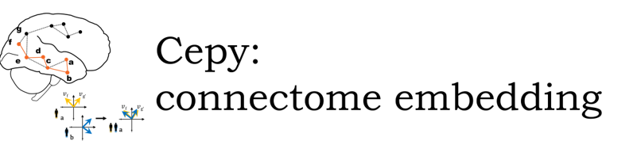

Welcome to Cepy's documentation!
================================

The Cepy pacakge is a python implementation of the connectome embedding (CE) framework.

Embedding of brain graph or connectome embedding (CE) involves finding a compact vectorized 
representation of nodes that captures their higher-order topological attributes. CE are 
obtained using the node2vec algorithm fitted on random walk on a brain graph. The current
framework includes a novel approach to align separately learned embeddings to the same 
latent space.

Installation
============

Cepy can be installed using pip:

.. code-block:: shell

  pip install cepy

Example Notebooks
=================
If you're looking for hands-on examples on connectome embeddings (CE) and Cepy, check out the links below. These are notebooks that go over the general methodology of the CE framework and how it is used in Cepy. They are available both as static GitHub pages and interactive Binder notebooks.

We recommend going over them in the following order:

* Random walk sampling (see a.i.) - `static <https://github.com/GidLev/cepy/blob/master/examples/random_walks_generation.ipynb>`__, |Binder 1|

.. |Binder 1| image:: https://mybinder.org/badge_logo.svg
   :target: https://mybinder.org/v2/gh/GidLev/cepy/master?filepath=examples%2Frandom_walks_generation.ipynb/

* Learning (fitting) connectome embedding (CE; see a.ii, a.iii) and mapping structural to functional connectivity (c.i) - `static <https://github.com/GidLev/cepy/blob/master/examples/learn_embedding.ipynb>`__, |Binder 2|

.. |Binder 2| image:: https://mybinder.org/badge_logo.svg
   :target: https://mybinder.org/v2/gh/GidLev/cepy/master?filepath=examples%2Flearn_embedding.ipynb/

* Aligning CEs within the same individual (independent fitting of the same subject) - `static <https://github.com/GidLev/cepy/blob/master/examples/intra_embedding_alignment.ipynb>`__, |Binder 3|

.. |Binder 3| image:: https://mybinder.org/badge_logo.svg
   :target: https://mybinder.org/v2/gh/GidLev/cepy/master?filepath=examples%2Fintra_embedding_alignment.ipynb/

* Aligning CEs between individuals (across subjects; see b) - `static <https://github.com/GidLev/cepy/blob/master/examples/inter_embedding_alignment.ipynb>`__, |Binder 4|

.. |Binder 4| image:: https://mybinder.org/badge_logo.svg
   :target: https://mybinder.org/v2/gh/GidLev/cepy/master?filepath=examples%2Finter_embedding_alignment.ipynb/

* Learning and aligning CEs of a large cohort (see a,b) -  `static <https://github.com/GidLev/cepy/blob/master/examples/ce_subjects_pipeline.ipynb>`__ 

* Predicting age from aligned CEs (see c.ii)-  `static <https://github.com/GidLev/cepy/blob/master/examples/ce_prediction.ipynb>`__, |Binder 5|

.. |Binder 5| image:: https://mybinder.org/badge_logo.svg
   :target: https://mybinder.org/v2/gh/GidLev/cepy/master?filepath=examples%2Fce_prediction.ipynb/

Quick start
================================

.. code-block:: python
	:linenos:

	import cepy as ce
	import numpy as np

	# Load an adjacency matrix (structural connectivity matrix)
	sc_group = ce.get_example('sc_group_matrix')

	# Initiate and fit the connectome embedding model
	ce_group = ce.CE(permutations = 1, seed=1)  
	ce_group.fit(sc_group)

	# Extract the cosine similarity matrix among pairwise nodes
	cosine_sim = ce_group.similarity()

	# Save and load the model
	ce_group.save_model('group_ce.pkl') 
	ce_loaded = ce.load_model('group_ce.pkl') # load it

	# Load two existing CE models  
	ce_subject1 = ce.get_example('ce_subject1')
	ce_subject2 = ce.get_example('ce_subject2')

	# Align the two to the space of the [ce]:
	ce_subject1_aligned = ce.align(ce_group, ce_subject1)
	ce_subject2_aligned = ce.align(ce_group, ce_subject2)

	# Extract the node vectorized representations (normalized) for subsequent use (prediction, for example) 
	w_sbject1 = ce_subject1_aligned.weights.get_w_mean(norm = True)
	w_sbject2 = ce_subject2_aligned.weights.get_w_mean(norm = True)

- see the full `API  <source/cepy.html>`_

Cite
================

If you find *cepy* useful for your research, please consider citing the following paper:
    
	Levakov, G., Faskowitz, J., Avidan, G. & Sporns, O. (2020). Mapping structure to function 
	and behavior with individual-level connectome embedding. In preparation

Acknowledgements
================

* The node2vec implementation is modeified from the `node2vec <https://github.com/eliorc/node2vec>`_ package by Elior Cohen and the `connectome_embedding <https://github.com/gidonro/Connectome-embeddings>`_ code by Gideon Rosenthal.
* Rosenthal, G., Váša, F., Griffa, A., Hagmann, P., Amico, E., Goñi, J., ... & Sporns, O. (2018). Mapping higher-order relations between brain structure and function with embedded vector representations of connectomes. Nature communications, 9(1), 1-12.

Indices and tables
==================

* :ref:`genindex`
* :ref:`modindex`
* :ref:`search`

